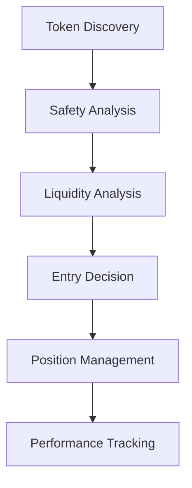

# Solana Trading Bot - Project Status

## Current State Overview

### Core Infrastructure Status

- ✅ Service Manager Implementation
- ✅ Provider System Architecture
- ✅ Authentication Service
- ✅ Logging Infrastructure
- ✅ Base Testing Framework
- ⚠️ WebSocket Integration (Partial)
- ❌ Frontend Implementation (Pending)

### Trading Features

#### Implemented (✅)

- Token Discovery System

  - Real-time token monitoring
  - Creator wallet analysis
  - Initial liquidity tracking
  - Safety score calculation

- Market Data Integration

  - Jupiter API Provider
  - Raydium Integration (In Progress)
  - Price data caching
  - Order book monitoring

- Risk Management
  - Position size calculation
  - Basic safety checks
  - Circuit breaker implementation
  - Error rate monitoring

#### In Progress (⚠️)

- Strategy Engine

  - Basic framework implemented
  - Template system pending
  - Custom indicators needed
  - Backtesting engine required

- Performance Tracking
  - Basic metrics implemented
  - Real-time monitoring needed
  - Historical analysis pending
  - Dashboard visualization required

#### Pending (❌)

- Frontend Components
  - Trading interface
  - Strategy builder
  - Performance dashboard
  - Alert system

## Technical Debt

### High Priority

1. **WebSocket Implementation**

   - Real-time price updates
   - Live position tracking
   - Performance metrics streaming
   - Connection management

2. **Strategy Engine Enhancement**

   - Strategy template system
   - Custom indicator support
   - Multi-timeframe analysis
   - Optimization engine

3. **Frontend Development**
   - Component architecture
   - State management with runes
   - Real-time data visualization
   - Error boundary implementation

### Medium Priority

1. **Testing Infrastructure**

   - E2E test implementation
   - Performance testing
   - Load testing scenarios
   - Mock data generation

2. **Documentation**

   - API documentation
   - Component documentation
   - Strategy development guide
   - Deployment guide

3. **Monitoring & Alerting**
   - Error tracking
   - Performance monitoring
   - System health checks
   - Alert configuration

### Low Priority

1. **Developer Experience**
   - Development environment setup
   - Local testing tools
   - Debug configuration
   - CI/CD optimization

## Architecture Notes

### Service Layer

```typescript
// Core service hierarchy
Service
├── BaseProvider
│   ├── JupiterProvider
│   └── RaydiumProvider
├── TokenSniper
└── StrategyEngine
```

### Data Flow



### Performance Metrics

- Token Discovery: < 500ms
- Analysis Pipeline: < 200ms
- Trade Execution: < 100ms
- Total Response: < 1 second

## Testing Status

### Coverage Goals

- Service Layer: 95% (Current: ~80%)
- Component Layer: 90% (Not Started)
- Integration Tests: 85% (Current: ~60%)
- E2E Tests: Key Flows (Not Started)

### Test Categories

1. **Unit Tests**

   - ✅ Service Manager
   - ✅ Authentication
   - ✅ Provider System
   - ⚠️ Strategy Engine

2. **Integration Tests**

   - ✅ API Integration
   - ⚠️ Database Operations
   - ❌ WebSocket Communication
   - ❌ Strategy Execution

3. **E2E Tests**
   - ❌ Trading Flows
   - ❌ Strategy Management
   - ❌ User Interactions
   - ❌ Performance Monitoring

## Security Considerations

### Implemented

- ✅ JWT Authentication
- ✅ Password Hashing
- ✅ Rate Limiting
- ✅ API Key Encryption

### Pending

- ❌ WebSocket Security
- ❌ Frontend Security
- ❌ Transaction Signing
- ❌ Audit Logging

## Development Roadmap

### Phase 1: Core Infrastructure (Current)

- ✅ Service Architecture
- ✅ Provider System
- ✅ Basic Testing
- ⚠️ Documentation

### Phase 2: Trading Features

- ⚠️ Strategy Engine
- ❌ Position Management
- ❌ Risk Management
- ❌ Performance Analytics

### Phase 3: User Interface

- ❌ Component Development
- ❌ State Management
- ❌ Real-time Updates
- ❌ Error Handling

### Phase 4: Production Ready

- ❌ Performance Optimization
- ❌ Security Hardening
- ❌ Monitoring Setup
- ❌ Deployment Pipeline

## Known Issues

### Critical

1. WebSocket integration incomplete
2. Frontend implementation missing
3. Strategy engine limitations
4. Real-time monitoring gaps

### Important

1. Test coverage below targets
2. Documentation gaps
3. Performance optimization needed
4. Security hardening required

### Minor

1. Development environment setup
2. Code style consistency
3. Error message standardization
4. Logging format optimization

## Next Steps

### Immediate Actions

1. Complete WebSocket integration
2. Start frontend development
3. Enhance strategy engine
4. Improve test coverage

### Short Term

1. Implement monitoring
2. Complete documentation
3. Setup CI/CD
4. Add security measures

### Long Term

1. Performance optimization
2. Scale testing
3. Advanced features
4. Community tools

## Developer Notes

### Environment Setup

```bash
# Required setup
cp .env.example .env
yarn install
npx prisma generate
npx prisma migrate dev

# Development
yarn dev          # Start development
yarn test         # Run tests
yarn build        # Production build
```

### Key Commands

```bash
yarn lint         # Run all linters
yarn test:coverage # Run tests with coverage
yarn test:e2e     # Run E2E tests
yarn type-check   # Run type checking
```

### Common Issues

1. **RPC Connection**

   - Use multiple endpoints
   - Implement retry logic
   - Monitor rate limits

2. **Performance**

   - Cache aggressively
   - Optimize WebSocket usage
   - Monitor memory usage

3. **Testing**
   - Mock external services
   - Use consistent test data
   - Maintain test isolation

### Best Practices

1. **Code Style**

   - Follow TypeScript strict mode
   - Document public APIs
   - Use type-safe patterns

2. **Testing**

   - Write tests first
   - Mock external dependencies
   - Test error cases

3. **Security**
   - Validate all inputs
   - Encrypt sensitive data
   - Implement rate limiting

## Contribution Guidelines

### Pull Request Process

1. Create feature branch
2. Add tests
3. Update documentation
4. Submit PR with description

### Code Review Checklist

- [ ] Tests included
- [ ] Documentation updated
- [ ] Types defined
- [ ] Error handling implemented
- [ ] Performance considered
- [ ] Security reviewed

### Documentation Requirements

- File overview
- Version information
- Usage instructions
- Type definitions
- Example usage
