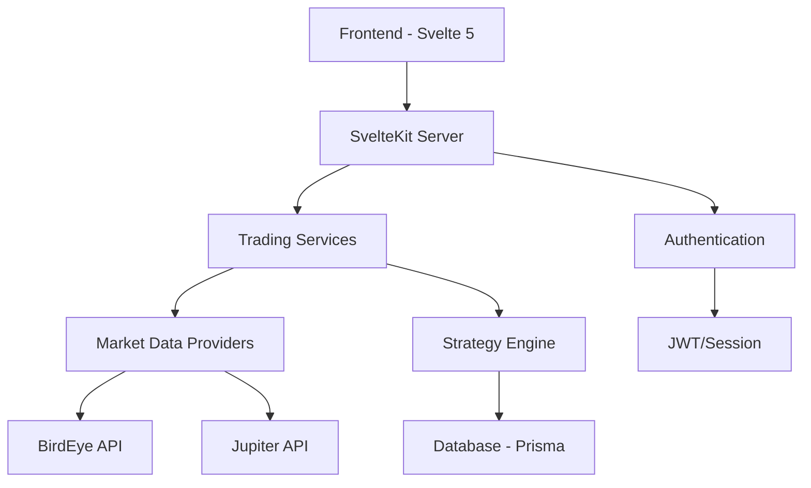

# Out of the Loop: Solana Trading Bot Developer Guide

## Core Architecture Overview



## System Components

### 1. Frontend Layer
- Svelte 5 with TypeScript
- Component-based architecture
- Reactive state management
- Toast-based error display
- Type-safe props and events

### 2. Server Layer
- SvelteKit with SSR
- API route handling
- Authentication middleware
- Request validation
- Error boundaries

### 3. Trading Infrastructure
```typescript
// Market Data Providers
abstract class BaseProvider {
  abstract getPrice(token: string): Promise<PriceData>;
  abstract getOHLCV(token: string, timeframe: TimeFrame): Promise<OHLCVData>;
}

// Strategy Engine
interface StrategyConfig {
  timeframe: string;
  profitTarget: number;
  stopLoss: number;
}
```

## Critical Files & Their Purpose

### 1. Configuration Files
```
├── svelte.config.js       # SvelteKit configuration, aliases
├── vite.config.ts         # Build tooling, plugins
├── prisma/schema.prisma   # Database schema
└── .env                   # Environment configuration
```

### 2. Core Application Logic
```
src/
├── lib/
│   ├── services/
│   │   ├── trading.service.ts     # Trading core logic
│   │   ├── birdeye.service.ts     # Market data integration
│   │   ├── wallet.service.ts      # Wallet management
│   │   └── strategy.service.ts    # Trading strategies
│   └── server/
│       ├── auth.ts                # Authentication
│       └── prisma.ts              # Database client
```

## Key Conventions

### 1. State Management
- Uses Svelte 5 runes for reactive state
- Centralized stores in `src/lib/stores/`
- Follows immutable update patterns

```typescript
// Example store pattern
export const selectedToken = writable<TokenInfo>();
export const chartData = writable<ChartData>();
```

### 2. Component Structure
- Components follow atomic design
- Each component has its own types
- Strict props validation

```
components/
├── ui/          # Base components
├── charts/      # Trading visualizations
└── forms/       # Input components
```

### 3. Testing Conventions
```typescript
// Test file naming
component.test.ts   // Component tests
service.test.ts     // Service tests
api.test.ts         // API tests
```

## Security Architecture

### 1. Authentication
- JWT-based with 7-day expiry
- Password hashing (bcrypt)
- Session management
- Rate limiting

### 2. API Security
```typescript
class ApiKeyService {
  private encryptApiKey(key: string): string {
    // AES-256-CBC encryption
  }
  
  private validateEncryptionKey() {
    // Key validation
  }
}
```

## Trading Features

### 1. Strategy Implementation
```typescript
// Mean Reversion Strategy
interface MeanReversionConfig extends BaseStrategyConfig {
  deviationThreshold: number;
  lookbackPeriod: number;
}

// Trend Following Strategy
interface TrendFollowingConfig extends BaseStrategyConfig {
  fastMA: number;
  slowMA: number;
  momentumPeriod: number;
}
```

### 2. Risk Management
- Position size calculation
- Stop-loss enforcement
- Profit targets
- Portfolio balance

## Development Workflow

### 1. Environment Setup
```bash
# Required steps
cp .env.example .env
yarn install
npx prisma generate
npx prisma migrate dev
```

### 2. Development Commands
```bash
yarn dev          # Start development
yarn test         # Run tests
yarn build        # Production build
```

## Testing Requirements

### 1. Coverage Requirements
- Services: 95%
- Components: 90%
- API Routes: 90%

### 2. Test Types
```typescript
// Required test categories
- Unit tests
- Integration tests
- E2E tests
- Performance tests
```

## Performance Considerations

### 1. Data Loading
- Implement proper caching
- Use SSR where appropriate
- Lazy load heavy components

### 2. State Updates
- Minimize store updates
- Use derived stores
- Implement proper cleanup

## Documentation Standards

### 1. Code Documentation
```typescript
/**
 * @description Execute trade with safety checks
 * @param {TradeParams} params - Trade parameters
 * @returns {Promise<TradeResult>}
 * @throws {TradingError}
 */
```

### 2. Component Documentation
```typescript
/**
 * @component
 * @example
 * <PriceChart
 *   token={selectedToken}
 *   timeRange="1h"
 * />
 */
```

## Known Limitations

### 1. Solana Integration
- Limited Web3.js implementation
- Wallet connection handling needed
- Transaction management to be improved
- RPC configuration required

### 2. Deployment
- Missing CI/CD configuration
- Production environment setup needed
- Monitoring configuration required
- Backup strategies to be implemented

## Debugging Tools

### 1. Available Tools
- Vite Dev Tools
- Svelte DevTools
- Prisma Studio

### 2. Logging
```typescript
logger.debug('Trading operation', { 
  operation: 'buy',
  details: { ... } 
});
``` 