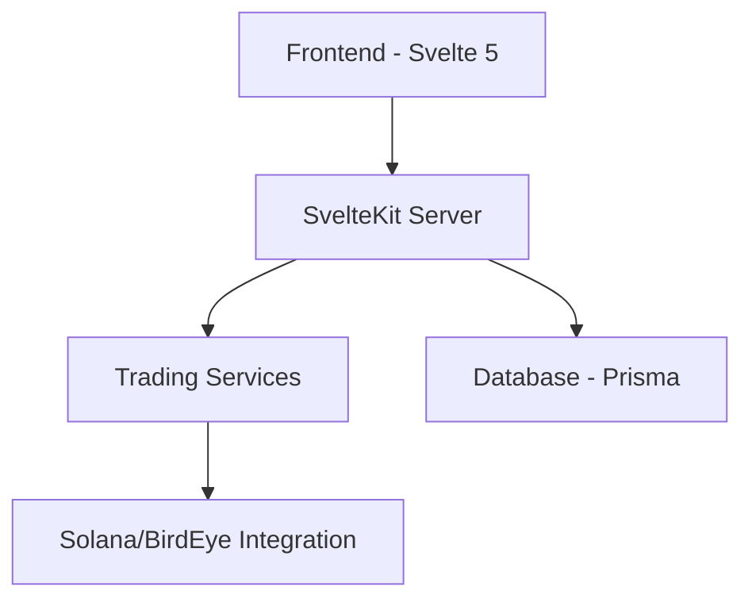

# Out of the Loop: Solana Trading Bot Developer Guide

## Core Architecture Overview



## Critical Files & Their Purpose

### 1. Configuration Files
```
├── svelte.config.js       # SvelteKit configuration, aliases
├── vite.config.ts         # Build tooling, plugins
├── prisma/schema.prisma   # Database schema
└── .env                   # Environment configuration
```

### 2. Core Application Logic
```
src/
├── lib/
│   ├── services/
│   │   ├── trading.service.ts     # Trading core logic
│   │   ├── birdeye.service.ts     # Market data integration
│   │   ├── wallet.service.ts      # Wallet management
│   │   └── strategy.service.ts    # Trading strategies
│   └── server/
│       ├── auth.ts                # Authentication
│       └── prisma.ts              # Database client
```

## Key Conventions

### 1. State Management
- Uses Svelte 5 runes for reactive state
- Centralized stores in `src/lib/stores/`
- Follows immutable update patterns

```typescript
// Example store pattern
export const selectedToken = writable<TokenInfo>();
export const chartData = writable<ChartData>();
```

### 2. Component Structure
- Components follow atomic design
- Each component has its own types
- Strict props validation

```
components/
├── ui/          # Base components
├── charts/      # Trading visualizations
└── forms/       # Input components
```

### 3. Testing Conventions
```typescript
// Test file naming
component.test.ts   // Component tests
service.test.ts     // Service tests
api.test.ts         // API tests
```

## Development Workflow

### 1. Environment Setup
```bash
# Required steps
cp .env.example .env
yarn install
npx prisma generate
npx prisma migrate dev
```

### 2. Development Commands
```bash
yarn dev          # Start development
yarn test         # Run tests
yarn build        # Production build
```

## Critical Paths

### 1. Trading Flow
```typescript
// Key files involved
src/lib/services/trading.service.ts
src/lib/services/birdeye.service.ts
src/routes/dashboard/+page.svelte
```

### 2. Authentication Flow
```typescript
// Key files involved
src/lib/server/auth.ts
src/routes/auth/+page.server.ts
src/hooks.server.ts
```

## Type System

### 1. Core Types
```typescript
// Located in src/lib/types/
interface Strategy {
  id: string;
  type: string;
  config: Record<string, unknown>;
}

interface Trade {
  pair: string;
  amount: number;
  type: 'BUY' | 'SELL';
}
```

### 2. API Contracts
```typescript
// Located in src/routes/api/
interface TradeRequest {
  tokenAddress: string;
  amount: number;
  slippage: number;
}
```

## Security Considerations

### 1. API Keys
- Stored encrypted in database
- Never exposed to client
- Rotated regularly

### 2. Authentication
- JWT-based
- Session management
- Rate limiting

## Common Patterns

### 1. Error Handling
```typescript
try {
  // Operation
} catch (error) {
  logger.error('Operation failed', { error });
  throw new TradingError(error.message);
}
```

### 2. Data Fetching
```typescript
// Server-side data loading
export const load = async ({ locals }) => {
  const strategies = await prisma.strategy.findMany({
    where: { userId: locals.userId }
  });
  return { strategies };
};
```

## Testing Requirements

### 1. Coverage Requirements
- Services: 95%
- Components: 90%
- API Routes: 90%

### 2. Test Types
```typescript
// Required test categories
- Unit tests
- Integration tests
- E2E tests
- Performance tests
```

## Performance Considerations

### 1. Data Loading
- Implement proper caching
- Use SSR where appropriate
- Lazy load heavy components

### 2. State Updates
- Minimize store updates
- Use derived stores
- Implement proper cleanup

## Documentation Standards

### 1. Code Documentation
```typescript
/**
 * @description Execute trade with safety checks
 * @param {TradeParams} params - Trade parameters
 * @returns {Promise<TradeResult>}
 * @throws {TradingError}
 */
```

### 2. Component Documentation
```typescript
/**
 * @component
 * @example
 * <PriceChart
 *   token={selectedToken}
 *   timeRange="1h"
 * />
 */
```

## Debugging Tools

### 1. Available Tools
- Vite Dev Tools
- Svelte DevTools
- Prisma Studio

### 2. Logging
```typescript
logger.debug('Trading operation', { 
  operation: 'buy',
  details: { ... } 
});
``` 